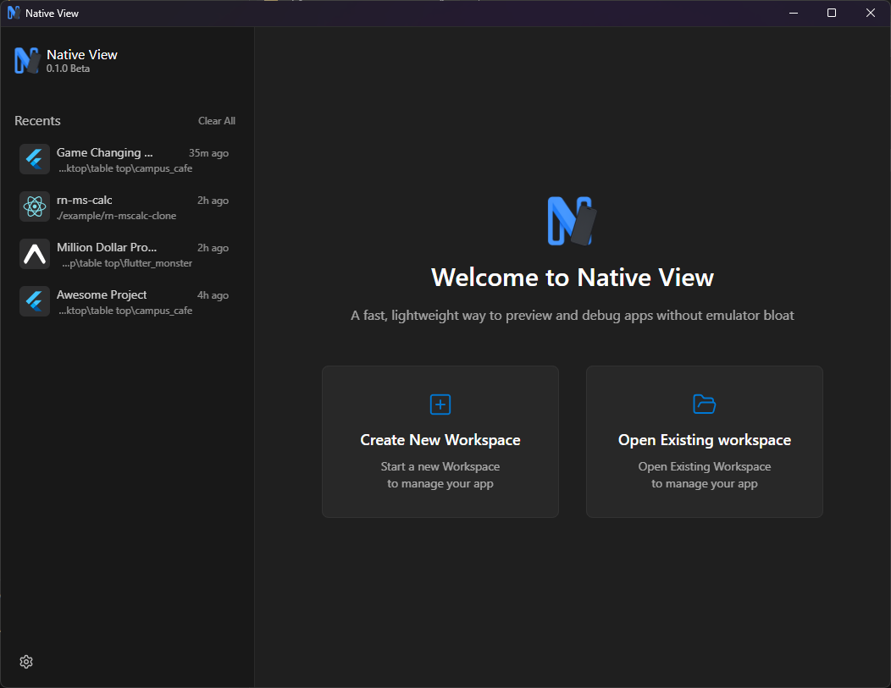
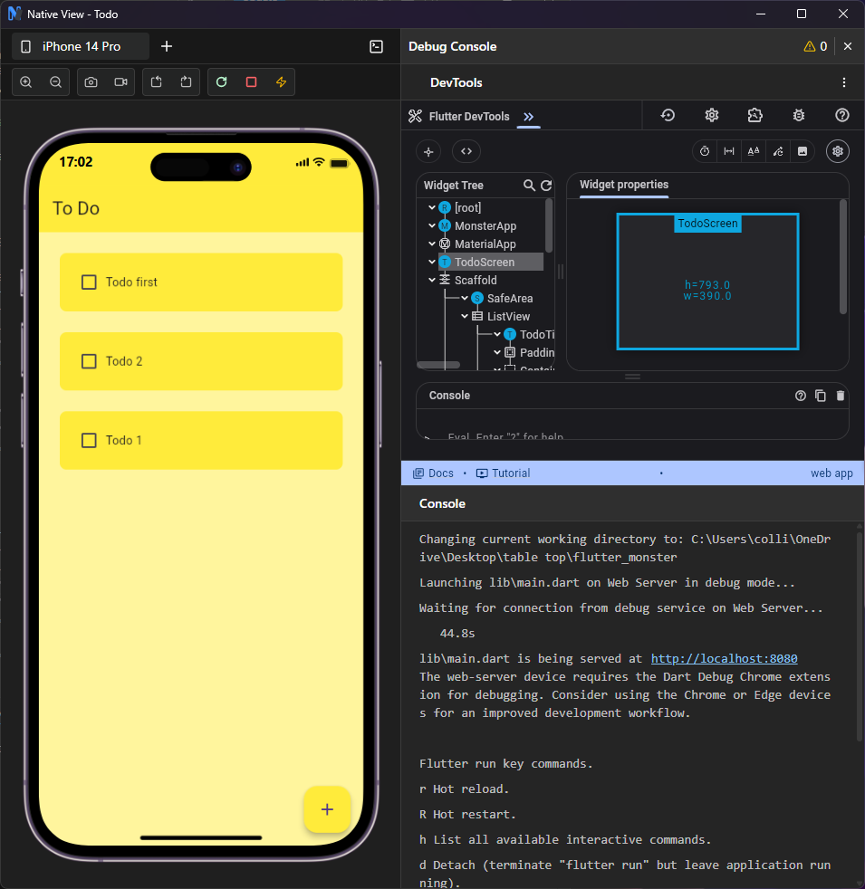

  

<h1 align="center">NativeView</h1>

### What is NativeView
NativeView is a lightweight desktop application for previewing and debugging Flutter, React Native, Expo and supported mobile development projects through realistic device simulations without the overhead of heavy traditional emulators.

  

  

### Features

- Preview applications inside simulated Android and iOS devices
- Fast application startup and preview workflow
- Start, stop, restart, and refresh development servers
- Open multiple device previews
- Built-in debug console for runtime logs and errors
- Framework DevTools integration (where supported)
- Workspace management for quick project switching

### Supported Frameworks

- Flutter
- React Native - coming soon
- Expo - coming soon

More frameworks are planned for future releases.

### Supported Platforms

- Windows
- macOS - coming soon
- Linux - coming soon

### Installation

Download the latest version of NativeView from the [Releases page](https://github.com/SageOfSixStacks/NativeView/releases#release-v0.1.0-beta).

1. Download the latest Native-View-Setup.exe file.
2. Run the installer.
3. Launch NativeView.

### Getting Started

#### 1. Create or Open a Workspace

Create a new workspace by selecting:

- Your project folder
- The framework
- Your preferred device

Or open an existing workspace from the recent workspaces list.

#### 2. Start the Application

Open the workspace and click Start.

NativeView automatically launches your development server and loads the application inside the selected virtual device.

#### 3. Debug

Use the built-in Debug Console to:

- View runtime logs
- Monitor errors and warnings
- Access framework DevTools (when available)

### Beta

NativeView is currently in beta.

You may encounter bugs or incomplete features as development continues. Feedback and bug reports are appreciated.
